# F.O.N.G. Arcade — Site Navigation Map

## Navigation Diagram

```mermaid
graph TD
    HOME["Homepage<br/>index.html"]

    HOME -->|featured| CARDS_HUB["Card Games Hub<br/>games/cards/index.html"]
    HOME -->|featured| MD_READER["MD Reader<br/>projects/md-reader/"]
    HOME --> ARCADE_HUB["Arcade Hub<br/>arcade/index.html"]
    HOME --> PUZZLE_HUB["Puzzle Hub<br/>puzzle/index.html"]
    HOME --> EDU["Letter Tracing<br/>games/tracing/"]
    HOME --> PROJECTS_HUB["Projects Hub<br/>projects/index.html"]
    HOME -.-> PROFILE["Profile<br/>profile/index.html"]

    subgraph "Card Games (5)"
        CARDS_HUB --> BJ[Blackjack v1.0.6]
        CARDS_HUB --> WAR[War v1.1.0]
        CARDS_HUB --> SOL[Solitaire v1.0]
        CARDS_HUB --> POKER[Poker Hall v0.9]
        CARDS_HUB --> BIG2[Big 2 v0.1]
    end

    subgraph "Arcade Games (10)"
        ARCADE_HUB --> SLOTS[Slots v3.1]
        ARCADE_HUB --> SNAKE[Neon Snake v3.0]
        ARCADE_HUB --> PONG[Pong v1.0]
        ARCADE_HUB --> SI[Space Invaders v1.0]
        ARCADE_HUB --> BO[Breakout v1.0]
        ARCADE_HUB --> SB[Sky Breakers v1.0]
        ARCADE_HUB --> AS[Animal Stack v1.0]
        ARCADE_HUB --> SPR[Sprunki v1.1]
        ARCADE_HUB --> JQ[Speed Quiz v4.x]
        ARCADE_HUB --> FC[Flash Classics v1.0]
    end

    subgraph "Puzzle Games (7)"
        PUZZLE_HUB --> FLOW[Flow v1.0]
        PUZZLE_HUB --> SUD[Sudoku v2.0]
        PUZZLE_HUB --> MINE[Minesweeper+ v1.0]
        PUZZLE_HUB --> MAH[Mahjong v1.0]
        PUZZLE_HUB --> JIG[Jigsaw v1.1]
        PUZZLE_HUB --> XTC[XTC Ball v5.0]
        PUZZLE_HUB --> BOARD[Board Games v0.3.1]
    end

    subgraph "Projects & Tools (10)"
        PROJECTS_HUB --> ST[Shipment Tracker v1.2]
        PROJECTS_HUB --> MD_READER
        PROJECTS_HUB --> ENC[Encyclopedia v1.0]
        PROJECTS_HUB --> DU[Dev Utils v1.0]
        PROJECTS_HUB --> IA[Input A11y v2.0]
        PROJECTS_HUB --> NTT[Name That Tune v1.0]
        PROJECTS_HUB --> CODE[C.o.D.E. v1.0]
        PROJECTS_HUB --> RB[Regex Builder v1.0]
        PROJECTS_HUB --> WA[Web Archive v2.0]
        PROJECTS_HUB --> TI[TI-tanium v1.0]
    end
```

## Program Index

| # | Program | Category | Hub | Path | Version |
|---|---------|----------|-----|------|---------|
| 1 | Blackjack | Card | Cards Hub | `./games/cards/blackjack/` | v1.0.6 |
| 2 | War | Card | Cards Hub | `./games/cards/war/` | v1.1.0 |
| 3 | Solitaire | Card | Cards Hub | `./games/cards/solitaire/` | v1.0 |
| 4 | Poker Hall | Card | Cards Hub | `./games/cards/` | v0.9 |
| 5 | Big 2 | Card | Cards Hub | `./games/cards/big2/` | v0.1 |
| 6 | Slots | Arcade | Arcade Hub | `./games/slots/` | v3.1 |
| 7 | Neon Snake | Arcade | Arcade Hub | `./games/snake/` | v3.0 |
| 8 | Pong | Arcade | Arcade Hub | `./games/pong/` | v1.0 |
| 9 | Space Invaders | Arcade | Arcade Hub | `./games/space_invaders/` | v1.0 |
| 10 | Breakout | Arcade | Arcade Hub | `./games/breakout/` | v1.0 |
| 11 | Sky Breakers | Arcade | Arcade Hub | `./games/sky_breakers/` | v1.0 |
| 12 | Animal Stack | Arcade | Arcade Hub | `./games/animal_stack/` | v1.0 |
| 13 | Sprunki Mixer | Arcade | Arcade Hub | `./games/sprunki/` | v1.1 |
| 14 | J: Speed Quiz | Arcade | Arcade Hub | `./games/j/` | v4.x |
| 15 | Flash Classics | Arcade | Arcade Hub | `./games/flash_classics/` | v1.0 |
| 16 | Flow | Puzzle | Puzzle Hub | `./games/flow/` | v1.0 |
| 17 | Sudoku | Puzzle | Puzzle Hub | `./games/sudoku/` | v2.0 |
| 18 | Minesweeper+ | Puzzle | Puzzle Hub | `./games/minesweeper/` | v1.0 |
| 19 | Mahjong | Puzzle | Puzzle Hub | `./games/mahjong/` | v1.0 |
| 20 | Jigsaw Engine | Puzzle | Puzzle Hub | `./games/jigsaw/` | v1.1 |
| 21 | XTC Ball | Puzzle | Puzzle Hub | `./games/xtc_ball/` | v5.0 |
| 22 | Board Games | Puzzle | Puzzle Hub | `./games/board/` | v0.3.1 |
| 23 | Letter Tracing | Edu | Homepage | `./games/tracing/` | v5.1 |
| 24 | Shipment Tracker | Project | Projects Hub | `./projects/shipment-tracker/` | v1.2 |
| 25 | MD Reader | Project | Projects Hub | `./projects/md-reader/` | v1.0 |
| 26 | Encyclopedia | Project | Projects Hub | `./projects/encyclopedia/` | v1.0 |
| 27 | Dev Utils | Project | Projects Hub | `./projects/dev-utils/` | v1.0 |
| 28 | Input A11y | Project | Projects Hub | `./projects/input-a11y/` | v2.0 |
| 29 | Name That Tune | Project | Projects Hub | `./projects/name-that-tune/` | v1.0 |
| 30 | C.o.D.E. | Project | Projects Hub | `./projects/code/` | v1.0 |
| 31 | Regex Builder | Project | Projects Hub | `./projects/regex_builder/` | v1.0 |
| 32 | Web Archive | Project | Projects Hub | `./projects/web-archive/` | v2.0 |
| 33 | TI-tanium | Project | Projects Hub | `./projects/project-ti-tanium/` | v1.0 |

## Hub Pages

| Hub | Path | Items | Back Link |
|-----|------|-------|-----------|
| Homepage | `./index.html` | Featured apps + nav cards | — |
| Arcade Hub | `./arcade/index.html` | 10 arcade games | Home |
| Card Games Hub | `./games/cards/index.html` | 5 card games | Home |
| Puzzle Hub | `./puzzle/index.html` | 7 puzzle games | Home |
| Projects Hub | `./projects/index.html` | 10 projects/tools | Home |
| Profile | `./profile/index.html` | Developer profile | Home |

## Data Sources

- **Runtime catalog**: `./js/catalog.js` (`FONG_CATALOG` array)
- **Static manifest**: `./js/manifest.json` (machine-readable sitemap)
